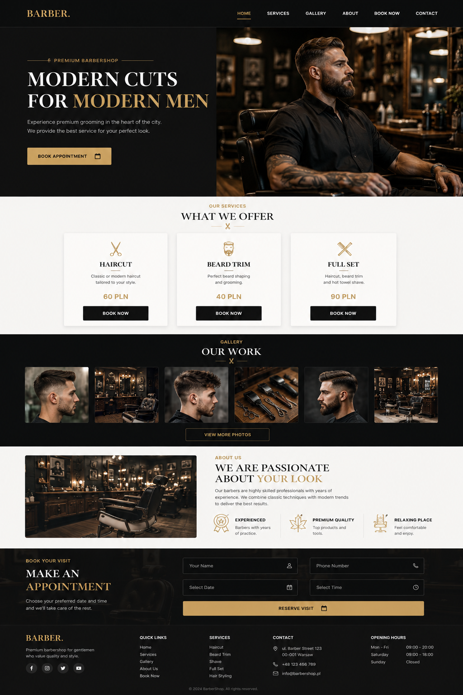

# 💈 Barber Shop Website

Nowoczesna, responsywna strona internetowa dla salonu barberskiego wykonana przy użyciu HTML, CSS oraz JavaScript.

## 📸 Podgląd projektu

Strona zawiera:

- Hero Section
- Sekcję usług
- Galerię zdjęć
- About Us
- Formularz rezerwacji wizyty
- Stopkę z danymi kontaktowymi
- Responsywne menu mobilne (Burger Menu)

---

## 🚀 Technologie

- HTML5
- CSS3
- JavaScript (Vanilla JS)
- CSS Grid
- Flexbox

---

## ✨ Funkcjonalności

### Hero Section

- Duże zdjęcie główne
- Call To Action
- Responsywny układ

### Services

- Prezentacja usług
- Ikony oraz ceny
- Efekty hover

### Gallery

- Galeria realizacji
- Responsywna siatka zdjęć
- Interaktywne animacje

### About Us

- Informacje o salonie
- Sekcja z wyróżnikami firmy

### Appointment Form

- Formularz rezerwacji
- Pola:
  - Imię
  - Numer telefonu
  - Data wizyty
  - Godzina wizyty

### Footer

- Linki nawigacyjne
- Dane kontaktowe
- Godziny otwarcia
- Ikony social media

---

## 📱 Responsywność

Projekt został dostosowany do:

- Desktop (1400px+)
- Tablet (≤ 992px)
- Mobile (≤ 768px)

W wersji mobilnej:

- aktywuje się Burger Menu
- sekcje przechodzą do układu jednokolumnowego
- formularz dostosowuje się do szerokości ekranu

---

## 📂 Struktura projektu

```text
project/
│
├── index.html
│
├── css/
│   └── style.css
│
├── js/
│   └── script.js
│
├── img/
│   ├── hero.jpg
│   ├── services/
│   ├── gallery/
│   └── icons/
│
└── README.md
```

---

## 🛠️ Uruchomienie projektu

1. Sklonuj repozytorium

```bash
git clone https://github.com/twoj-login/barber-shop.git
```

2. Otwórz plik:

```text
index.html
```

lub uruchom lokalny serwer:

```bash
Live Server
```

---

## 🎨 Inspiracja

Projekt inspirowany nowoczesnymi stronami Premium Barber Shop, z naciskiem na elegancki wygląd, ciemną kolorystykę oraz złote akcenty.

---

## 👨‍💻 Autor

Projekt wykonany jako ćwiczenie front-endowe z wykorzystaniem HTML, CSS oraz JavaScript.


